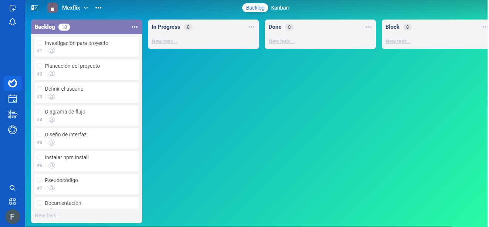
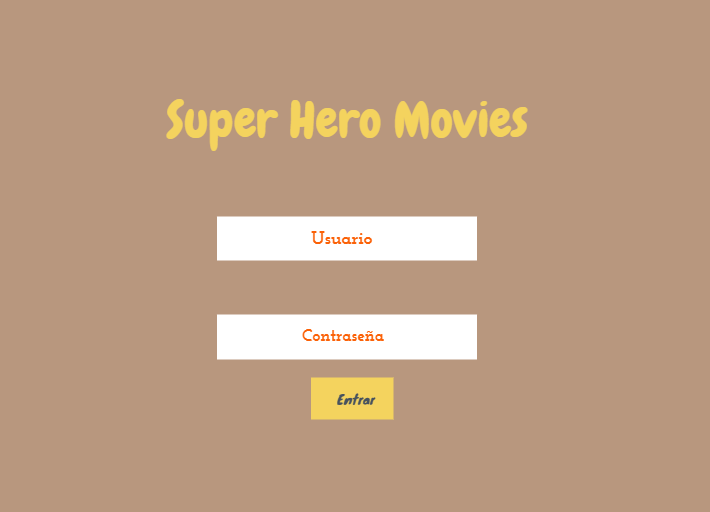

# **INDICE**

1. Descripción
2. Definición del Usuario
3. Edición Hacker
4. Planeación del proyecto
5. Diagrama de flujo
6. Maquetación
7. Pseudocódigo
8. Producto final

---

## **Descripción**

_Aplicación que nos ayude a ver un catálogo de peliculas de super héroes._

---

## **Definición de Usuario**

_Los usuarios quieren leer una selección adecuada de películas de super héroes._

_El usuario quiere ver un buen catálogo de películas ya preseleccionadas._

_El usuario quiere poder buscar para encontrar más películas por título, año y actores._

---

## **Edición Hacker**

_No está limitado a implementar solo la parte obligatoria. También puede agregar otras funcionalidades agradables en esta aplicación web, como un inicio de sesión de autenticación, una creación de lista de favoritos usando una matriz y almacenamiento por ahora, en el objeto localStoragebrowser._

---

## **Planeación del proyecto**

---

## **Diagrama de Flujo**

---

## **Maquetación**

---

## **Pseudocódigo**

---

## **Producto final**

---
