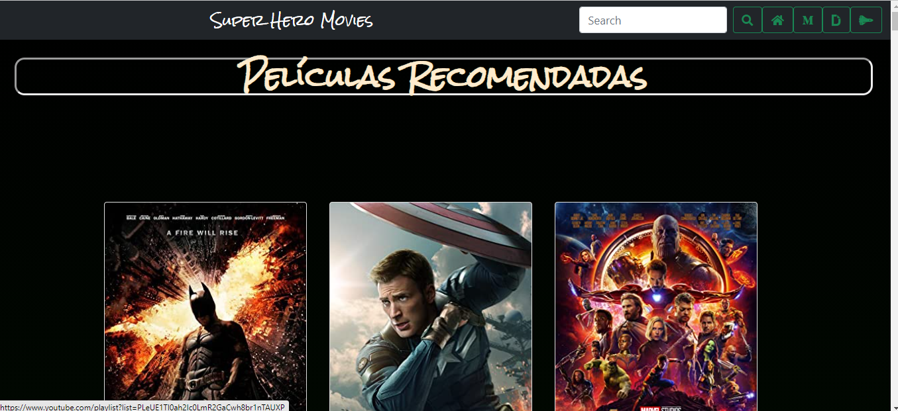
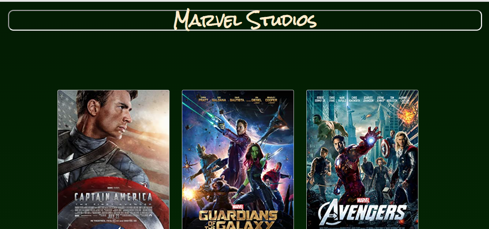
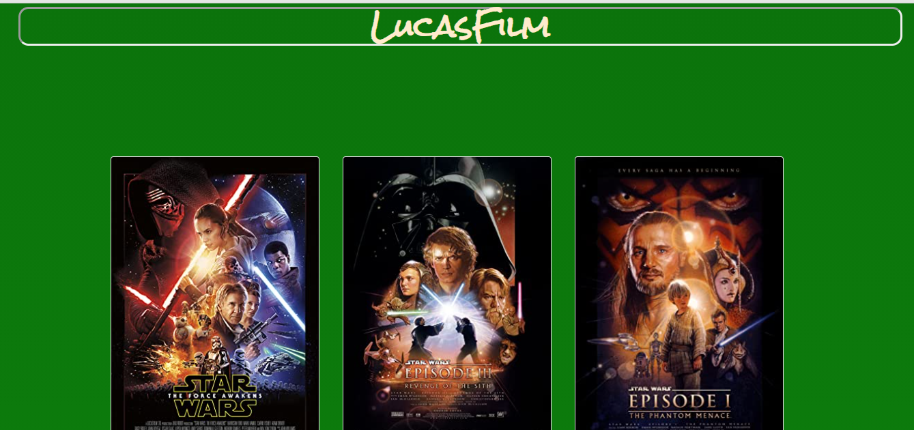

# **INDICE**

1. Descripción
2. Definición del Usuario
3. Planeación del proyecto
4. Diagrama de flujo
5. Maquetación
6. Pseudocódigo
7. Producto final

---

## **Descripción**

_Aplicación que nos ayude a ver un catálogo de peliculas de super héroes._

---

## **Definición de Usuario**

_Los usuarios quieren leer una selección adecuada de películas de super héroes._

_El usuario quiere ver un buen catálogo de películas ya preseleccionadas._

_El usuario quiere poder buscar para encontrar más películas por título._

---

## **Planeación del proyecto**

---

## **Diagrama de Flujo**

---

## **Maquetación**

---

## **Pseudocódigo**

### HTML

* Se agrega liga de bootstrap
* Se agrega liga de font awesome
* Se crea un main para mantener unido el contenido principal
* Se crea un section para la primera pantalla, para ingresar datos del usuario
* Se crea un div para contener la pantalla 2 que contendrá el catálogo de peliculas
* Se añade un navbar para la barra de navegacion y busqueda
* Se crea un contenedor para estilizar pantalla de catálogo
* Se añade la card de busqueda
* Aquí va la pelicula encontrada y las peliculas pre-seleccionadas
* Aquí van los catalogos de cada productora
* Se agrega el footer
* Se vincula el index.js en tipo modulo

### Index.js

* Se atrae el id de la segunda pantalla con getElementById para ayudar a ocultar la primera pantalla cuando el ususario ingrese
* Dentro de la segunda pantalla//Se crea una funcion para generar el buscador de peliculas//Aquí va el DOM //Se importa la API desde data.js
* Se trae el valor de input
* Se trigerea el boton de busqueda

### Data.js

* Se crea una funcion para renderear la busqueda de películas
* Se exporta desde index.js//Se crea una funcion que contendra los datos de la API
* Se crea una pre-seleccion de peliculas
* Traer pre-seleccion desde API
* iterar seleccion//fetch a la API
* rendering pre-seleccion
* Se crea la colección de peliculas de Marvel
* Traer seleccion desde API
* iterar seleccion//fetch a la API
* Se crea el rendering para marvel
* Se crea la coleccion de DC Comics
* Se crea la coleccion de LucasFilm
* Se crea el rendering de LucasFilm

---

## **Producto final**

---

